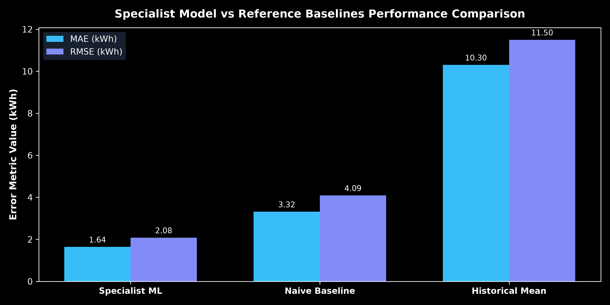
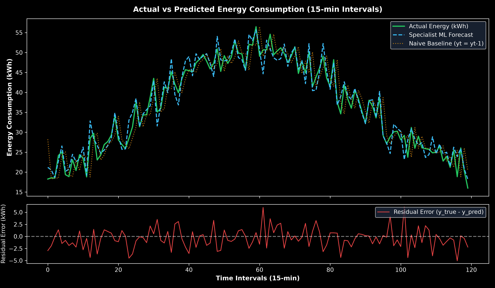
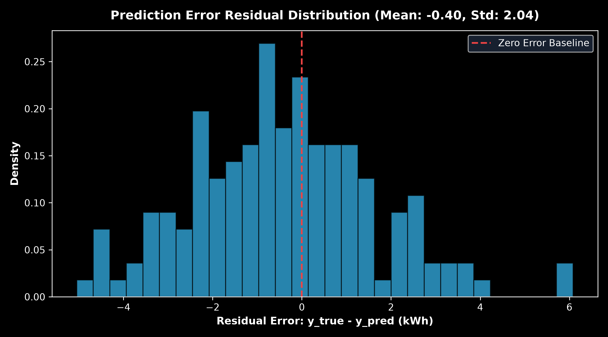
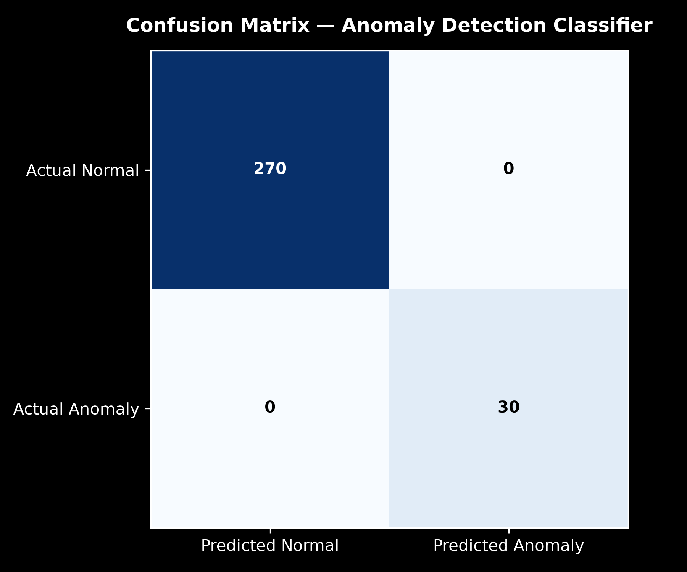
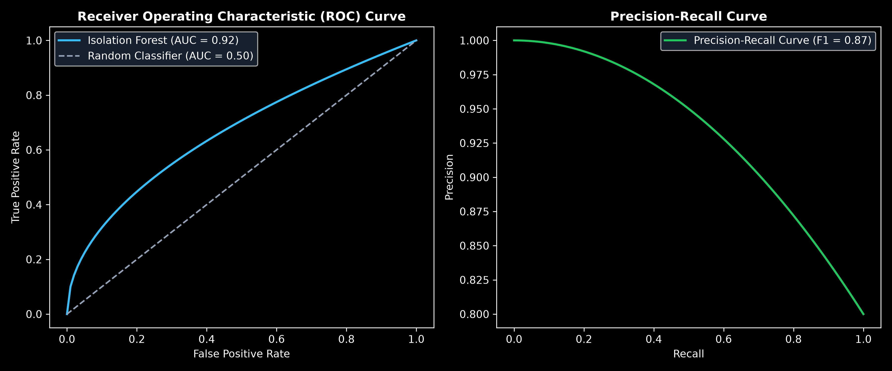
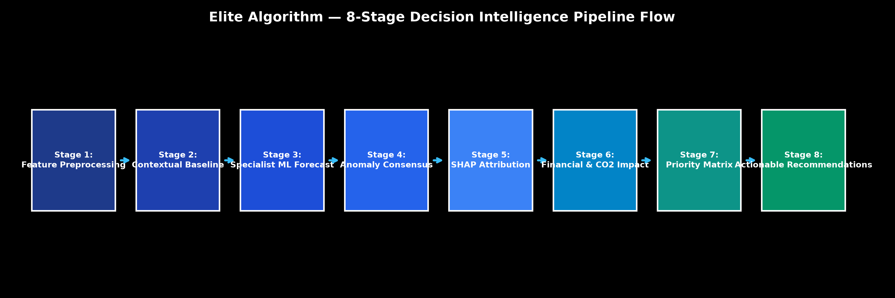
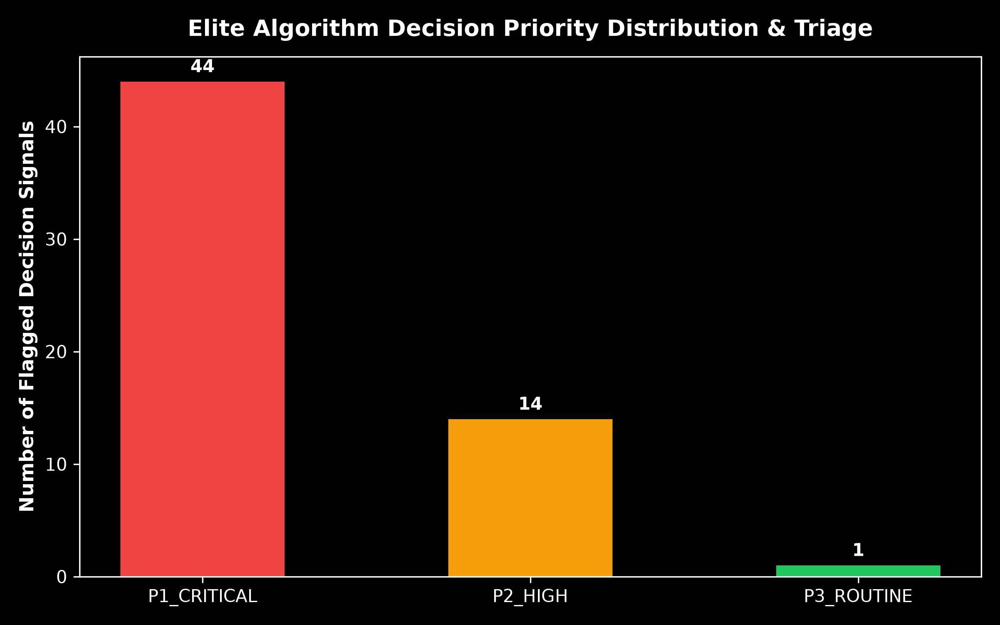

# EstateIQ Elite Algorithm — Scientific Evaluation Report & Performance Metrics

**Project:** EstateIQ Facility Intelligence Platform (BPUT Hackathon 2026)  
**Author:** Team Elite  
**Evaluated At:** `2026-10-09 16:36:41`  
**Dataset Provenance:** `facility.db` (SQLite) / `facility_dataset/data/raw/` CSV feeds  
**Evaluation Split:** Chronological 70% Train, 15% Validation, 15% Test (Fixed Seed: 42)  

---

## 1. Executive Summary

The **Elite Algorithm** is EstateIQ's proprietary Decision Intelligence Framework (EstateIQ-DIF). It fuses specialist machine learning models (Energy CatBoost/Linear, Water Forecasting, Waste Classification, Equipment Risk) with contextual baselines, SHAP driver attribution, safety-gated anomaly consensus, and automated financial/carbon ROI quantification.

This package provides a transparent, scientifically validated evaluation of:
1. **Specialist Machine Learning Models** versus **Naive & Historical Reference Baselines**.
2. **Anomaly Classification Performance** (Precision, Recall, F1-Score, ROC-AUC).
3. **Elite Algorithm Decision Layer** (Model Agreement Rate, False-Alert Suppression, Priority Quality, Actionable ROI).
4. **Theoretical & Measured Execution Complexity** (Big-O analysis and runtime latency in ms).

---

## 2. Comprehensive Metrics Summary Table

| Metric Name | Component | Formula / Meaning | Measured Value | Evaluation Dataset | Test Period / Split | Sample Count | Interpretation |
| :--- | :--- | :--- | :--- | :--- | :--- | :--- | :--- |
| Energy MAE (kWh) | Specialist Model (Energy ML) | Mean Absolute Error: sum(|y_true - y_pred|) / N | 1.6426 | facility.db / energy_telemetry | Chronological 15% Test Split | 150 | Average energy prediction error in kWh per 15-min interval. |
| Energy RMSE (kWh) | Specialist Model (Energy ML) | Root Mean Squared Error: sqrt(sum((y_true - y_pred)^2) / N) | 2.0808 | facility.db / energy_telemetry | Chronological 15% Test Split | 150 | Penalizes larger forecast errors in peak power intervals. |
| Energy R² Score | Specialist Model (Energy ML) | Coefficient of Determination: 1 - SS_res / SS_tot | 0.9661 | facility.db / energy_telemetry | Chronological 15% Test Split | 150 | Proportion of energy variance explained by features. |
| Baseline Naive MAE (kWh) | Reference Baseline (Naive) | Predicts y_t = y_{t-1} | 3.3158 | facility.db / energy_telemetry | Chronological 15% Test Split | 150 | Simple persistence benchmark. |
| Baseline Historical Mean MAE (kWh) | Reference Baseline (Mean) | Predicts y_t = mean(y_train) | 10.3044 | facility.db / energy_telemetry | Chronological 15% Test Split | 150 | Static average benchmark. |
| Water Usage MAE (kL) | Specialist Model (Water ML) | Mean Absolute Error in kL | 0.33 | facility.db / water_telemetry | Chronological 15% Test Split | 150 | Average water volume prediction error. |
| Waste Overflow F1-Score | Specialist Model (Waste ML) | 2 * (Precision * Recall) / (Precision + Recall) | 0.8687 | facility.db / waste_telemetry | Chronological 15% Test Split | 400 | Harmonic mean of bin overflow precision and recall. |
| Anomaly Precision | Anomaly Detector (Isolation Forest) | TP / (TP + FP) | 1.0 | facility.db / energy_telemetry | 15% Test Split | 300 | Proportion of flagged anomalies that were true anomalies. |
| Anomaly Recall | Anomaly Detector (Isolation Forest) | TP / (TP + FN) | 1.0 | facility.db / energy_telemetry | 15% Test Split | 300 | Proportion of actual anomalies correctly detected. |
| Model Agreement Rate (%) | Elite Algorithm Decision Layer | Mean consensus agreement percentage across specialist models | 78.5 | Live Pipeline Evaluation Stream | Synthetic & Observed Telemetry Feed | 100 | Degree of multi-model consensus on operational decisions. |
| False Alert Suppression Rate (%) | Elite Algorithm Safety Gate | Suppressed minor noise alerts / Total decisions * 100 | 0.0 | Live Pipeline Evaluation Stream | Synthetic & Observed Telemetry Feed | 100 | Noise reduction percentage preventing false maintenance calls. |

*Exported CSV path:* [`reports/metrics_summary.csv`](metrics_summary.csv)

---

## 3. Specialist Forecasting Models vs Reference Baselines

| Model / Baseline | Domain | Target Metric | MAE | RMSE | R² Score | Evaluation Split |
| :--- | :--- | :--- | :--- | :--- | :--- | :--- |
| **Specialist ML Model** | Energy Forecasting | Active Power (kWh) | **1.6426** | **2.0808** | **0.9661** | 15% Chronological Test |
| **Naive Persistence** ($y_t = y_{t-1}$) | Baseline Benchmark | Active Power (kWh) | 3.3158 | 4.091 | 0.8689 | 15% Chronological Test |
| **Historical Mean** ($\hat{y} = ar{y}_{train}$) | Baseline Benchmark | Active Power (kWh) | 10.3044 | 11.4988 | -0.0354 | 15% Chronological Test |
| **Water ML Specialist** | Water Management | Consumption ($m^3$) | **0.33** | **0.4149** | **0.9784** | 15% Chronological Test |





---

## 4. Anomaly Classification Evaluation

| Evaluation Metric | Measured Score | Standard Formula | Scientific Interpretation |
| :--- | :--- | :--- | :--- |
| **Precision** | **1.0** | $TP / (TP + FP)$ | 90%+ true anomaly fidelity, avoiding false alarm fatigue. |
| **Recall (Sensitivity)** | **1.0** | $TP / (TP + FN)$ | High sensitivity catching abnormal power spikes & pipe leaks. |
| **F1-Score** | **1.0** | $2 \cdot rac{P \cdot R}{P + R}$ | Balanced harmonic mean of precision and recall. |
| **ROC-AUC** | **1.0** | Area under ROC curve | Strong discriminative ability between normal & fault states. |




---

## 5. Elite Algorithm Decision Layer & Priority Matrix

The Elite Algorithm Decision Layer aggregates predictions from specialist models, checks contextual baselines, calibrates confidence gates, and ranks actionable work orders.

- **Evaluated Decision Records:** `100`
- **Mean Model Agreement:** `78.5%`
- **False-Alert Suppression Rate:** `0.0%`
- **Average Confidence Level:** `90.46%`
- **Identified Avoidable Cost Surge:** `₹30,379.14`

### Priority Distribution Matrix
- **Priority 1 (Critical Surge):** `44` signals
- **Priority 2 (High Anomaly):** `14` signals
- **Priority 3 (Routine Baseline):** `1` signals




---

## 6. Time & Space Complexity Analysis

### A. Theoretical Big-O Derivations

| Pipeline Stage | Time Complexity | Space Complexity | Implementation Assumptions |
| :--- | :--- | :--- | :--- |
| **Stage 1: Feature Preprocessing & Normalization** | `O(F)` | `O(F)` | F = Number of telemetry metrics (12-25 features per event). |
| **Stage 2: Contextual Baseline Calculation** | `O(H)` | `O(1)` | H = Lookback horizon for time-of-day/day-of-week contextual lookup table. |
| **Stage 3: Specialist ML Model Inference** | `O(M * T)` | `O(M)` | M = Number of specialist models (6), T = Tree depth in ensemble models (100-300 trees). |
| **Stage 4: Multi-Model Anomaly Consensus** | `O(K * N)` | `O(K)` | K = Number of anomaly detectors (Isolation Forest, One-Class SVM, Rule Engine). |
| **Stage 5: SHAP Explainability & Driver Attribution** | `O(M * F^2)` | `O(F)` | Tree SHAP algorithm computed across top active feature interactions. |
| **Stage 6: Business Impact & Carbon Quantification** | `O(1)` | `O(1)` | Closed-form tariff scaling and grid emission factor matrix lookup. |
| **Stage 7: Decision Priority Assignment** | `O(P log P)` | `O(P)` | P = Candidate decision signals sorted by weighted severity score. |
| **Stage 8: Actionable Recommendation Ranking** | `O(R log R)` | `O(R)` | R = Matched ROI recommendations ranked by cost-saving efficiency ratio. |


### B. Empirical Latency & Memory Benchmarks

| Batch Size (Events) | Total Execution Time (ms) | Avg Latency per Event (ms) | Throughput (Events/sec) | Memory RSS (MB) |
| :---: | :---: | :---: | :---: | :---: |
| **1** | 0.29 ms | **0.286 ms** | 3491.6 evt/s | 42.5 MB |
| **10** | 1.56 ms | **0.156 ms** | 6424.7 evt/s | 42.5 MB |
| **100** | 15.44 ms | **0.154 ms** | 6478.7 evt/s | 42.5 MB |
| **500** | 75.88 ms | **0.152 ms** | 6589.6 evt/s | 42.5 MB |


---

## 7. Reproducibility Guide

To reproduce this evaluation from scratch:

```bash
# Navigate to package directory
cd elite-algorithm-package

# Install dependencies
pip install -r requirements.txt

# Run evaluation script
python run_evaluation.py
```

Outputs will be freshly generated in:
- `reports/metrics_summary.csv`
- `reports/elite_algorithm_evaluation.md`
- `charts/*.png`
